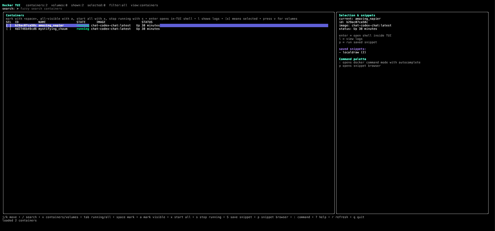

# Docker TUI

A single-binary Docker terminal UI built with Go + Bubble Tea.

## Screenshot



## Features

- View all Docker containers
- View Docker volumes
- Fuzzy search containers, volumes, and snippets
- Vim-style navigation: `j/k`, `g`, `G`
- Filter running containers only
- Multi-select containers with visible `[x]` markers
- Start selected containers or all containers
- Stop selected containers or all running containers
- Save selected containers as named snippets
- Snippets store container names and can run:
  - `docker start <name1> <name2> ...`
  - `docker stop <name1> <name2> ...`
- Snippet browser supports:
  - fuzzy search
  - multi-select
  - start selected/current snippet containers
  - stop selected/current snippet containers
  - delete selected/current snippets
  - delete all snippets
- In-TUI container shell
- Container logs viewer with latest-first open, keyboard/mouse scrolling, search, match navigation, horizontal scrolling, fullscreen mode, and colored log levels
- Docker command palette with autocomplete
- Detects and reports when Docker is not running
- Single binary output

## Requirements

You need:

- Go `1.26+`
- Docker CLI installed and available in `PATH`
- Docker daemon/service running
- `make` (optional, only if you want to use the `Makefile` targets)

Go dependencies are fetched automatically from `go.mod`:

- `github.com/charmbracelet/bubbletea`
- `github.com/charmbracelet/bubbles`
- `github.com/charmbracelet/lipgloss`
- `github.com/creack/pty`

## Build from source

### Manual build

```bash
go mod tidy
go build -o docker-tui .
```

This produces a single local binary:

```bash
./docker-tui
```

### Build with Makefile

Build the local binary:

```bash
make build
```

This creates:

```bash
./docker-tui
```

Run it directly:

```bash
./docker-tui
```

Or build and run with Makefile:

```bash
make run
```

Useful Make targets:

```bash
make build               # build local binary at ./docker-tui
make run                 # build and run
make tidy                # tidy go modules
make test                # run tests
make clean               # remove local and release binaries
make release             # build all release binaries in dist/
make release-linux-amd64 # rebuild dist/docker-tui_linux_amd64
make release-linux-arm64 # rebuild dist/docker-tui_linux_arm64
```

> `make build` only refreshes `./docker-tui`. It does **not** update `dist/`.
> If you are testing on Linux or WSL, rebuild the release binary with
> `make release-linux-amd64` (or `make release`) before running `dist/docker-tui_linux_amd64`.

## Release binaries

Create release binaries with:

```bash
make release
```

This generates binaries in `dist/`:

- `docker-tui_darwin_arm64`
- `docker-tui_darwin_amd64`
- `docker-tui_linux_amd64`
- `docker-tui_linux_arm64`

### Platform note

- macOS binaries **do not** run on Linux or WSL
- for Linux use a `linux_*` binary
- for WSL use the Linux binary, typically:
  - `dist/docker-tui_linux_amd64`

So no separate WSL-only binary is needed.

## Run

```bash
./docker-tui
```

## Main keys

- `j/k` or arrow keys: move
- `g` / `G`: jump to top / bottom
- `/`: focus fuzzy search
- `v`: switch between containers and volumes
- `tab`: toggle all/running filter for containers
- `space`: select/unselect current container
- `a`: select/unselect all visible containers
- `x`: start selected containers, or all containers if none selected
- `s`: stop selected containers, or all running containers if none selected
- `S`: save selected containers as a snippet
- `p`: open snippet browser
- `Enter`: open interactive PTY shell for selected running container inside the TUI
- `l`: show logs for selected container
- `f`: toggle log follow mode
- `:`: open Docker command palette with autocomplete
- `?`: show/hide keyboard help
- `r`: refresh containers and volumes
- `q`: quit

## Snippet workflow

### Save a snippet

1. Select multiple containers with `space`
2. Press `S`
3. Enter a snippet name
4. Press `Enter`

The snippet stores the selected container **names**.

### Open snippet browser

Press:

```text
p
```

### Snippet browser keys

- `/`: search snippets with fuzzy search
- `esc`: leave search, then close browser
- `j/k`: move
- `space`: mark/unmark current snippet
- `a`: mark/unmark all visible snippets
- `x`: run `docker start` for selected snippets, or current snippet if none selected
- `s`: run `docker stop` for selected snippets, or current snippet if none selected
- `d`: delete selected snippets, or current snippet if none selected, with confirmation
- `D`: delete all snippets, with confirmation
- after `d` or `D`: `tab` or `←/→` switches Yes/No, `enter` confirms selected option, `esc` cancels

## Logs

To view logs:

1. Select a container
2. Press `l`

When logs open:

- it opens focused on the logs pane
- it shows the latest logs first
- the logs pane is highlighted as the active pane
- you can toggle a fullscreen logs view with `z`

Inside logs view:

- `j/k` or arrow keys: scroll logs vertically
- `h/l` or left/right keys: scroll logs horizontally
- mouse wheel: scroll logs vertically
- drag with mouse in logs pane: select log text
- `y`: copy selected log text to clipboard
- `c`: clear selected log text
- `ctrl+u` / `ctrl+d`: page up / page down
- `g` / `G`: jump to top / bottom
- `/`: search logs
- `n` / `N`: next / previous search result position
- `z`: toggle fullscreen logs pane
- `enter` in search: keep search and return to logs navigation
- `esc`: leave search, or leave logs if search is not active
- `f`: toggle follow mode for latest logs
- log levels like `ERROR`, `WARN`, `INFO`, `DEBUG`, `TRACE` are colorized
- selected log text can be copied on macOS, Linux, and WSL
- `enter` or `esc`: return from logs view

## In-TUI shell

To open a shell inside the TUI:

1. Select a **running** container
2. Press `Enter`

Inside shell view:

- it uses a real PTY-backed interactive shell via `docker exec -u 0 -it ...`
- shell state is preserved properly (`cd /`, history, tab completion inside the container shell, etc.)
- the shell pane includes an embedded cursor/terminal viewport inside the TUI
- commands run as root inside the container
- `ctrl+q`: close the shell and return to the TUI
- `space`: works normally inside the shell
- `esc`: is passed through to the shell
- `ctrl+l`: clears inside the shell

## Snippet storage

Snippets are stored at:

```text
~/.config/docker-tui/snippets.json
```
